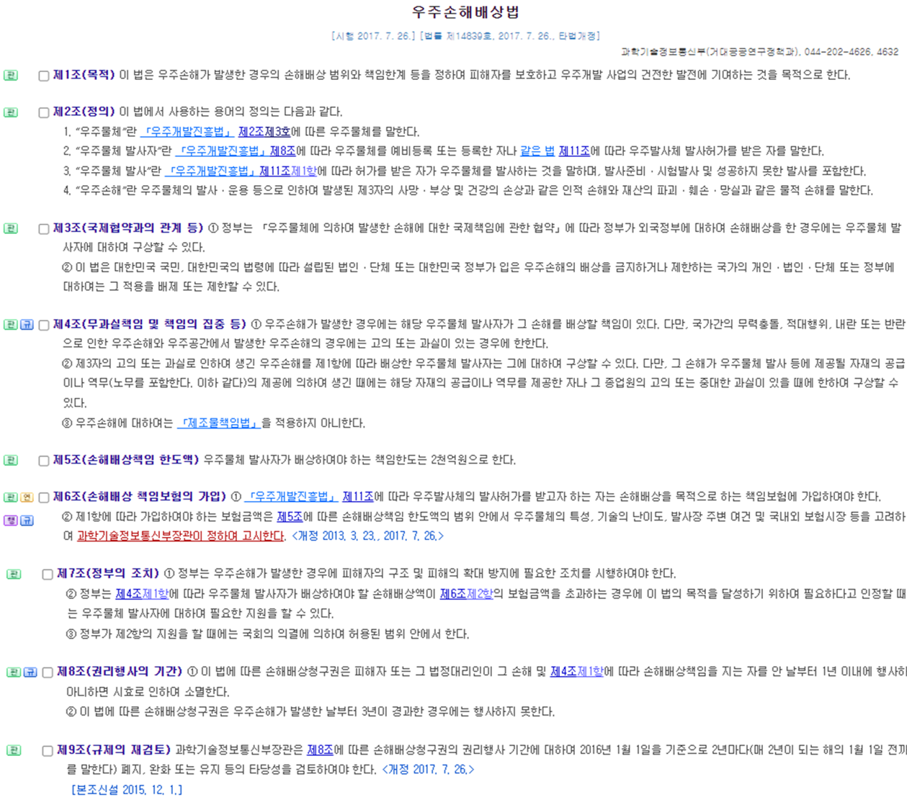

# 데이터


::: {.cell}

```{.r .cell-code}
library(tidyverse)
library(readxl)
library(gt)
library(gtExtras)


# # 사무판단
# law_raw <- read_excel("data/(230410)최종결과표(통합본).xlsx", skip = 0)
# 
# law_tbl <- law_raw |>
#   janitor::clean_names(ascii = FALSE) |> 
#   mutate(사무_판단 = ifelse(is.na(사무_판단), 0, 사무_판단)) |> 
#   mutate(사무유형 = str_remove(사무유형, "\r\n")) |>
#   # 사무유형: 국가, 시도, 공동, ...
#   mutate(사무유형 = case_when(사무유형 == "국가시도" ~ "국가-시도",
#                               사무유형 == "정부" ~ "국가",
#                               사무유형 == "공동" ~ "국가-시도",
#                               is.na(사무유형) ~ "없음",
#                               TRUE ~ 사무유형))  |> 
#   rename(부처명 = 소관_부처명)
# 
# space_law <- law_tbl |> 
#   filter(법령명 == "우주손해배상법") 
# 
# space_law |> 
#   write_rds("data/space_law.rds")

space_law <- 
  read_rds("data/space_law.rds")

```
:::


# 시각화

## 법령 웹페이지와 엑셀

::: {.panel-tabset}

### 데이터 {.unnumbered}


::: {.cell}

```{.r .cell-code}
space_law |> 
  transmute(법령문 = glue::glue("{paste0('제',조_번호, '조 ')}",
                             "{ifelse(is.na(항_번호), '', paste0(항_번호, '항 '))}",
                             "{ifelse(is.na(호_번호), '', paste0(호_번호, '호 '))}",
                             "{조문제목} {조문}" )) |> 
  gt::gt() |> 
  cols_align(align = "left")
```

::: {.cell-output-display}
```{=html}
<div id="ywhohltpfh" style="padding-left:0px;padding-right:0px;padding-top:10px;padding-bottom:10px;overflow-x:auto;overflow-y:auto;width:auto;height:auto;">
<style>#ywhohltpfh table {
  font-family: system-ui, 'Segoe UI', Roboto, Helvetica, Arial, sans-serif, 'Apple Color Emoji', 'Segoe UI Emoji', 'Segoe UI Symbol', 'Noto Color Emoji';
  -webkit-font-smoothing: antialiased;
  -moz-osx-font-smoothing: grayscale;
}

#ywhohltpfh thead, #ywhohltpfh tbody, #ywhohltpfh tfoot, #ywhohltpfh tr, #ywhohltpfh td, #ywhohltpfh th {
  border-style: none;
}

#ywhohltpfh p {
  margin: 0;
  padding: 0;
}

#ywhohltpfh .gt_table {
  display: table;
  border-collapse: collapse;
  line-height: normal;
  margin-left: auto;
  margin-right: auto;
  color: #333333;
  font-size: 16px;
  font-weight: normal;
  font-style: normal;
  background-color: #FFFFFF;
  width: auto;
  border-top-style: solid;
  border-top-width: 2px;
  border-top-color: #A8A8A8;
  border-right-style: none;
  border-right-width: 2px;
  border-right-color: #D3D3D3;
  border-bottom-style: solid;
  border-bottom-width: 2px;
  border-bottom-color: #A8A8A8;
  border-left-style: none;
  border-left-width: 2px;
  border-left-color: #D3D3D3;
}

#ywhohltpfh .gt_caption {
  padding-top: 4px;
  padding-bottom: 4px;
}

#ywhohltpfh .gt_title {
  color: #333333;
  font-size: 125%;
  font-weight: initial;
  padding-top: 4px;
  padding-bottom: 4px;
  padding-left: 5px;
  padding-right: 5px;
  border-bottom-color: #FFFFFF;
  border-bottom-width: 0;
}

#ywhohltpfh .gt_subtitle {
  color: #333333;
  font-size: 85%;
  font-weight: initial;
  padding-top: 3px;
  padding-bottom: 5px;
  padding-left: 5px;
  padding-right: 5px;
  border-top-color: #FFFFFF;
  border-top-width: 0;
}

#ywhohltpfh .gt_heading {
  background-color: #FFFFFF;
  text-align: center;
  border-bottom-color: #FFFFFF;
  border-left-style: none;
  border-left-width: 1px;
  border-left-color: #D3D3D3;
  border-right-style: none;
  border-right-width: 1px;
  border-right-color: #D3D3D3;
}

#ywhohltpfh .gt_bottom_border {
  border-bottom-style: solid;
  border-bottom-width: 2px;
  border-bottom-color: #D3D3D3;
}

#ywhohltpfh .gt_col_headings {
  border-top-style: solid;
  border-top-width: 2px;
  border-top-color: #D3D3D3;
  border-bottom-style: solid;
  border-bottom-width: 2px;
  border-bottom-color: #D3D3D3;
  border-left-style: none;
  border-left-width: 1px;
  border-left-color: #D3D3D3;
  border-right-style: none;
  border-right-width: 1px;
  border-right-color: #D3D3D3;
}

#ywhohltpfh .gt_col_heading {
  color: #333333;
  background-color: #FFFFFF;
  font-size: 100%;
  font-weight: normal;
  text-transform: inherit;
  border-left-style: none;
  border-left-width: 1px;
  border-left-color: #D3D3D3;
  border-right-style: none;
  border-right-width: 1px;
  border-right-color: #D3D3D3;
  vertical-align: bottom;
  padding-top: 5px;
  padding-bottom: 6px;
  padding-left: 5px;
  padding-right: 5px;
  overflow-x: hidden;
}

#ywhohltpfh .gt_column_spanner_outer {
  color: #333333;
  background-color: #FFFFFF;
  font-size: 100%;
  font-weight: normal;
  text-transform: inherit;
  padding-top: 0;
  padding-bottom: 0;
  padding-left: 4px;
  padding-right: 4px;
}

#ywhohltpfh .gt_column_spanner_outer:first-child {
  padding-left: 0;
}

#ywhohltpfh .gt_column_spanner_outer:last-child {
  padding-right: 0;
}

#ywhohltpfh .gt_column_spanner {
  border-bottom-style: solid;
  border-bottom-width: 2px;
  border-bottom-color: #D3D3D3;
  vertical-align: bottom;
  padding-top: 5px;
  padding-bottom: 5px;
  overflow-x: hidden;
  display: inline-block;
  width: 100%;
}

#ywhohltpfh .gt_spanner_row {
  border-bottom-style: hidden;
}

#ywhohltpfh .gt_group_heading {
  padding-top: 8px;
  padding-bottom: 8px;
  padding-left: 5px;
  padding-right: 5px;
  color: #333333;
  background-color: #FFFFFF;
  font-size: 100%;
  font-weight: initial;
  text-transform: inherit;
  border-top-style: solid;
  border-top-width: 2px;
  border-top-color: #D3D3D3;
  border-bottom-style: solid;
  border-bottom-width: 2px;
  border-bottom-color: #D3D3D3;
  border-left-style: none;
  border-left-width: 1px;
  border-left-color: #D3D3D3;
  border-right-style: none;
  border-right-width: 1px;
  border-right-color: #D3D3D3;
  vertical-align: middle;
  text-align: left;
}

#ywhohltpfh .gt_empty_group_heading {
  padding: 0.5px;
  color: #333333;
  background-color: #FFFFFF;
  font-size: 100%;
  font-weight: initial;
  border-top-style: solid;
  border-top-width: 2px;
  border-top-color: #D3D3D3;
  border-bottom-style: solid;
  border-bottom-width: 2px;
  border-bottom-color: #D3D3D3;
  vertical-align: middle;
}

#ywhohltpfh .gt_from_md > :first-child {
  margin-top: 0;
}

#ywhohltpfh .gt_from_md > :last-child {
  margin-bottom: 0;
}

#ywhohltpfh .gt_row {
  padding-top: 8px;
  padding-bottom: 8px;
  padding-left: 5px;
  padding-right: 5px;
  margin: 10px;
  border-top-style: solid;
  border-top-width: 1px;
  border-top-color: #D3D3D3;
  border-left-style: none;
  border-left-width: 1px;
  border-left-color: #D3D3D3;
  border-right-style: none;
  border-right-width: 1px;
  border-right-color: #D3D3D3;
  vertical-align: middle;
  overflow-x: hidden;
}

#ywhohltpfh .gt_stub {
  color: #333333;
  background-color: #FFFFFF;
  font-size: 100%;
  font-weight: initial;
  text-transform: inherit;
  border-right-style: solid;
  border-right-width: 2px;
  border-right-color: #D3D3D3;
  padding-left: 5px;
  padding-right: 5px;
}

#ywhohltpfh .gt_stub_row_group {
  color: #333333;
  background-color: #FFFFFF;
  font-size: 100%;
  font-weight: initial;
  text-transform: inherit;
  border-right-style: solid;
  border-right-width: 2px;
  border-right-color: #D3D3D3;
  padding-left: 5px;
  padding-right: 5px;
  vertical-align: top;
}

#ywhohltpfh .gt_row_group_first td {
  border-top-width: 2px;
}

#ywhohltpfh .gt_row_group_first th {
  border-top-width: 2px;
}

#ywhohltpfh .gt_summary_row {
  color: #333333;
  background-color: #FFFFFF;
  text-transform: inherit;
  padding-top: 8px;
  padding-bottom: 8px;
  padding-left: 5px;
  padding-right: 5px;
}

#ywhohltpfh .gt_first_summary_row {
  border-top-style: solid;
  border-top-color: #D3D3D3;
}

#ywhohltpfh .gt_first_summary_row.thick {
  border-top-width: 2px;
}

#ywhohltpfh .gt_last_summary_row {
  padding-top: 8px;
  padding-bottom: 8px;
  padding-left: 5px;
  padding-right: 5px;
  border-bottom-style: solid;
  border-bottom-width: 2px;
  border-bottom-color: #D3D3D3;
}

#ywhohltpfh .gt_grand_summary_row {
  color: #333333;
  background-color: #FFFFFF;
  text-transform: inherit;
  padding-top: 8px;
  padding-bottom: 8px;
  padding-left: 5px;
  padding-right: 5px;
}

#ywhohltpfh .gt_first_grand_summary_row {
  padding-top: 8px;
  padding-bottom: 8px;
  padding-left: 5px;
  padding-right: 5px;
  border-top-style: double;
  border-top-width: 6px;
  border-top-color: #D3D3D3;
}

#ywhohltpfh .gt_last_grand_summary_row_top {
  padding-top: 8px;
  padding-bottom: 8px;
  padding-left: 5px;
  padding-right: 5px;
  border-bottom-style: double;
  border-bottom-width: 6px;
  border-bottom-color: #D3D3D3;
}

#ywhohltpfh .gt_striped {
  background-color: rgba(128, 128, 128, 0.05);
}

#ywhohltpfh .gt_table_body {
  border-top-style: solid;
  border-top-width: 2px;
  border-top-color: #D3D3D3;
  border-bottom-style: solid;
  border-bottom-width: 2px;
  border-bottom-color: #D3D3D3;
}

#ywhohltpfh .gt_footnotes {
  color: #333333;
  background-color: #FFFFFF;
  border-bottom-style: none;
  border-bottom-width: 2px;
  border-bottom-color: #D3D3D3;
  border-left-style: none;
  border-left-width: 2px;
  border-left-color: #D3D3D3;
  border-right-style: none;
  border-right-width: 2px;
  border-right-color: #D3D3D3;
}

#ywhohltpfh .gt_footnote {
  margin: 0px;
  font-size: 90%;
  padding-top: 4px;
  padding-bottom: 4px;
  padding-left: 5px;
  padding-right: 5px;
}

#ywhohltpfh .gt_sourcenotes {
  color: #333333;
  background-color: #FFFFFF;
  border-bottom-style: none;
  border-bottom-width: 2px;
  border-bottom-color: #D3D3D3;
  border-left-style: none;
  border-left-width: 2px;
  border-left-color: #D3D3D3;
  border-right-style: none;
  border-right-width: 2px;
  border-right-color: #D3D3D3;
}

#ywhohltpfh .gt_sourcenote {
  font-size: 90%;
  padding-top: 4px;
  padding-bottom: 4px;
  padding-left: 5px;
  padding-right: 5px;
}

#ywhohltpfh .gt_left {
  text-align: left;
}

#ywhohltpfh .gt_center {
  text-align: center;
}

#ywhohltpfh .gt_right {
  text-align: right;
  font-variant-numeric: tabular-nums;
}

#ywhohltpfh .gt_font_normal {
  font-weight: normal;
}

#ywhohltpfh .gt_font_bold {
  font-weight: bold;
}

#ywhohltpfh .gt_font_italic {
  font-style: italic;
}

#ywhohltpfh .gt_super {
  font-size: 65%;
}

#ywhohltpfh .gt_footnote_marks {
  font-size: 75%;
  vertical-align: 0.4em;
  position: initial;
}

#ywhohltpfh .gt_asterisk {
  font-size: 100%;
  vertical-align: 0;
}

#ywhohltpfh .gt_indent_1 {
  text-indent: 5px;
}

#ywhohltpfh .gt_indent_2 {
  text-indent: 10px;
}

#ywhohltpfh .gt_indent_3 {
  text-indent: 15px;
}

#ywhohltpfh .gt_indent_4 {
  text-indent: 20px;
}

#ywhohltpfh .gt_indent_5 {
  text-indent: 25px;
}
</style>
<table class="gt_table" data-quarto-disable-processing="false" data-quarto-bootstrap="false">
  <thead>
    
    <tr class="gt_col_headings">
      <th class="gt_col_heading gt_columns_bottom_border gt_left" rowspan="1" colspan="1" scope="col" id="법령문">법령문</th>
    </tr>
  </thead>
  <tbody class="gt_table_body">
    <tr><td headers="법령문" class="gt_row gt_left">제1조 목적 제1조(목적) 이 법은 우주손해가 발생한 경우의 손해배상 범위와 책임한계 등을 정하여 피해자를 보호하고 우주개발 사업의 건전한 발전에 기여하는 것을 목적으로 한다.</td></tr>
    <tr><td headers="법령문" class="gt_row gt_left">제2조 정의 제2조(정의) 이 법에서 사용하는 용어의 정의는 다음과 같다.</td></tr>
    <tr><td headers="법령문" class="gt_row gt_left">제2조 1호 정의 1. "우주물체"란 「우주개발진흥법」 제2조제3호에 따른 우주물체를 말한다.</td></tr>
    <tr><td headers="법령문" class="gt_row gt_left">제2조 2호 정의 2. "우주물체 발사자"란 「우주개발진흥법」제8조에 따라 우주물체를 예비등록 또는 등록한 자나 같은 법 제11조에 따라 우주발사체 발사허가를 받은 자를 말한다.</td></tr>
    <tr><td headers="법령문" class="gt_row gt_left">제2조 3호 정의 3. "우주물체 발사"란 「우주개발진흥법」제11조제1항에 따라 허가를 받은 자가 우주물체를 발사하는 것을 말하며, 발사준비ㆍ시험발사 및 성공하지 못한 발사를 포함한다.</td></tr>
    <tr><td headers="법령문" class="gt_row gt_left">제2조 4호 정의 4. "우주손해"란 우주물체의 발사ㆍ운용 등으로 인하여 발생된 제3자의 사망ㆍ부상 및 건강의 손상과 같은 인적 손해와 재산의 파괴ㆍ훼손ㆍ망실과 같은 물적 손해를 말한다.</td></tr>
    <tr><td headers="법령문" class="gt_row gt_left">제3조 국제협약과의 관계 등 제3조(국제협약과의 관계 등)</td></tr>
    <tr><td headers="법령문" class="gt_row gt_left">제3조 1항 국제협약과의 관계 등 ① 정부는 「우주물체에 의하여 발생한 손해에 대한 국제책임에 관한 협약」에 따라 정부가 외국정부에 대하여 손해배상을 한 경우에는 우주물체 발사자에 대하여 구상할 수 있다.</td></tr>
    <tr><td headers="법령문" class="gt_row gt_left">제3조 2항 국제협약과의 관계 등 ② 이 법은 대한민국 국민, 대한민국의 법령에 따라 설립된 법인ㆍ단체 또는 대한민국 정부가 입은 우주손해의 배상을 금지하거나 제한하는 국가의 개인ㆍ법인ㆍ단체 또는 정부에 대하여는 그 적용을 배제 또는 제한할 수 있다.</td></tr>
    <tr><td headers="법령문" class="gt_row gt_left">제4조 무과실책임 및 책임의 집중 등 제4조(무과실책임 및 책임의 집중 등)</td></tr>
    <tr><td headers="법령문" class="gt_row gt_left">제4조 1항 무과실책임 및 책임의 집중 등 ① 우주손해가 발생한 경우에는 해당 우주물체 발사자가 그 손해를 배상할 책임이 있다. 다만, 국가간의 무력충돌, 적대행위, 내란 또는 반란으로 인한 우주손해와 우주공간에서 발생한 우주손해의 경우에는 고의 또는 과실이 있는 경우에 한한다.</td></tr>
    <tr><td headers="법령문" class="gt_row gt_left">제4조 2항 무과실책임 및 책임의 집중 등 ② 제3자의 고의 또는 과실로 인하여 생긴 우주손해를 제1항에 따라 배상한 우주물체 발사자는 그에 대하여 구상할 수 있다. 다만, 그 손해가 우주물체 발사 등에 제공될 자재의 공급이나 역무(노무를 포함한다. 이하 같다)의 제공에 의하여 생긴 때에는 해당 자재의 공급이나 역무를 제공한 자나 그 종업원의 고의 또는 중대한 과실이 있을 때에 한하여 구상할 수 있다.</td></tr>
    <tr><td headers="법령문" class="gt_row gt_left">제4조 3항 무과실책임 및 책임의 집중 등 ③ 우주손해에 대하여는 「제조물책임법」을 적용하지 아니한다.</td></tr>
    <tr><td headers="법령문" class="gt_row gt_left">제5조 손해배상책임 한도액 제5조(손해배상책임 한도액) 우주물체 발사자가 배상하여야 하는 책임한도는 2천억원으로 한다.</td></tr>
    <tr><td headers="법령문" class="gt_row gt_left">제6조 손해배상 책임보험의 가입 제6조(손해배상 책임보험의 가입)</td></tr>
    <tr><td headers="법령문" class="gt_row gt_left">제6조 1항 손해배상 책임보험의 가입 ① 「우주개발진흥법」 제11조에 따라 우주발사체의 발사허가를 받고자 하는 자는 손해배상을 목적으로 하는 책임보험에 가입하여야 한다.</td></tr>
    <tr><td headers="법령문" class="gt_row gt_left">제6조 2항 손해배상 책임보험의 가입 ② 제1항에 따라 가입하여야 하는 보험금액은 제5조에 따른 손해배상책임 한도액의 범위 안에서 우주물체의 특성, 기술의 난이도, 발사장 주변 여건 및 국내외 보험시장 등을 고려하여 과학기술정보통신부장관이 정하여 고시한다. &lt;개정 2013.3.23, 2017.7.26&gt;</td></tr>
    <tr><td headers="법령문" class="gt_row gt_left">제7조 정부의 조치 제7조(정부의 조치)</td></tr>
    <tr><td headers="법령문" class="gt_row gt_left">제7조 1항 정부의 조치 ① 정부는 우주손해가 발생한 경우에 피해자의 구조 및 피해의 확대 방지에 필요한 조치를 시행하여야 한다.</td></tr>
    <tr><td headers="법령문" class="gt_row gt_left">제7조 2항 정부의 조치 ② 정부는 제4조제1항에 따라 우주물체 발사자가 배상하여야 할 손해배상액이 제6조제2항의 보험금액을 초과하는 경우에 이 법의 목적을 달성하기 위하여 필요하다고 인정할 때에는 우주물체 발사자에 대하여 필요한 지원을 할 수 있다.</td></tr>
    <tr><td headers="법령문" class="gt_row gt_left">제7조 3항 정부의 조치 ③ 정부가 제2항의 지원을 할 때에는 국회의 의결에 의하여 허용된 범위 안에서 한다.</td></tr>
    <tr><td headers="법령문" class="gt_row gt_left">제8조 권리행사의 기간 제8조(권리행사의 기간)</td></tr>
    <tr><td headers="법령문" class="gt_row gt_left">제8조 1항 권리행사의 기간 ① 이 법에 따른 손해배상청구권은 피해자 또는 그 법정대리인이 그 손해 및 제4조제1항에 따라 손해배상책임을 지는 자를 안 날부터 1년 이내에 행사하지 아니하면 시효로 인하여 소멸한다.</td></tr>
    <tr><td headers="법령문" class="gt_row gt_left">제8조 2항 권리행사의 기간 ② 이 법에 따른 손해배상청구권은 우주손해가 발생한 날부터 3년이 경과한 경우에는 행사하지 못한다.</td></tr>
    <tr><td headers="법령문" class="gt_row gt_left">제9조 규제의 재검토 제9조(규제의 재검토) 과학기술정보통신부장관은 제8조에 따른 손해배상청구권의 권리행사 기간에 대하여 2016년 1월 1일을 기준으로 2년마다(매 2년이 되는 해의 1월 1일 전까지를 말한다) 폐지, 완화 또는 유지 등의 타당성을 검토하여야 한다. &lt;개정 2017.7.26&gt;</td></tr>
  </tbody>
  
  
</table>
</div>
```
:::
:::


### 법 텍스트 {.unnumbered}

우주손해배상법

[시행 2017. 7. 26.] [법률 제14839호, 2017. 7. 26., 타법개정]
과학기술정보통신부(거대공공연구정책과), 044-202-4626, 4632

조문체계도버튼
 제1조(목적) 이 법은 우주손해가 발생한 경우의 손해배상 범위와 책임한계 등을 정하여 피해자를 보호하고 우주개발 사업의 건전한 발전에 기여하는 것을 목적으로 한다.

조문체계도버튼
 제2조(정의) 이 법에서 사용하는 용어의 정의는 다음과 같다.

1. “우주물체”란 「우주개발진흥법」 제2조제3호에 따른 우주물체를 말한다.

2. “우주물체 발사자”란 「우주개발진흥법」제8조에 따라 우주물체를 예비등록 또는 등록한 자나 같은 법 제11조에 따라 우주발사체 발사허가를 받은 자를 말한다.

3. “우주물체 발사”란 「우주개발진흥법」제11조제1항에 따라 허가를 받은 자가 우주물체를 발사하는 것을 말하며, 발사준비ㆍ시험발사 및 성공하지 못한 발사를 포함한다.

4. “우주손해”란 우주물체의 발사ㆍ운용 등으로 인하여 발생된 제3자의 사망ㆍ부상 및 건강의 손상과 같은 인적 손해와 재산의 파괴ㆍ훼손ㆍ망실과 같은 물적 손해를 말한다.

조문체계도버튼
 제3조(국제협약과의 관계 등) ① 정부는 「우주물체에 의하여 발생한 손해에 대한 국제책임에 관한 협약」에 따라 정부가 외국정부에 대하여 손해배상을 한 경우에는 우주물체 발사자에 대하여 구상할 수 있다.

② 이 법은 대한민국 국민, 대한민국의 법령에 따라 설립된 법인ㆍ단체 또는 대한민국 정부가 입은 우주손해의 배상을 금지하거나 제한하는 국가의 개인ㆍ법인ㆍ단체 또는 정부에 대하여는 그 적용을 배제 또는 제한할 수 있다.

조문체계도버튼관련규제버튼
 제4조(무과실책임 및 책임의 집중 등) ① 우주손해가 발생한 경우에는 해당 우주물체 발사자가 그 손해를 배상할 책임이 있다. 다만, 국가간의 무력충돌, 적대행위, 내란 또는 반란으로 인한 우주손해와 우주공간에서 발생한 우주손해의 경우에는 고의 또는 과실이 있는 경우에 한한다.

② 제3자의 고의 또는 과실로 인하여 생긴 우주손해를 제1항에 따라 배상한 우주물체 발사자는 그에 대하여 구상할 수 있다. 다만, 그 손해가 우주물체 발사 등에 제공될 자재의 공급이나 역무(노무를 포함한다. 이하 같다)의 제공에 의하여 생긴 때에는 해당 자재의 공급이나 역무를 제공한 자나 그 종업원의 고의 또는 중대한 과실이 있을 때에 한하여 구상할 수 있다.

③ 우주손해에 대하여는 「제조물책임법」을 적용하지 아니한다.

조문체계도버튼
 제5조(손해배상책임 한도액) 우주물체 발사자가 배상하여야 하는 책임한도는 2천억원으로 한다.

조문체계도버튼연혁위임행정규칙버튼관련규제버튼
 제6조(손해배상 책임보험의 가입) ① 「우주개발진흥법」 제11조에 따라 우주발사체의 발사허가를 받고자 하는 자는 손해배상을 목적으로 하는 책임보험에 가입하여야 한다.

② 제1항에 따라 가입하여야 하는 보험금액은 제5조에 따른 손해배상책임 한도액의 범위 안에서 우주물체의 특성, 기술의 난이도, 발사장 주변 여건 및 국내외 보험시장 등을 고려하여 과학기술정보통신부장관이 정하여 고시한다. <개정 2013. 3. 23., 2017. 7. 26.>

위임행정규칙
조문체계도버튼
 제7조(정부의 조치) ① 정부는 우주손해가 발생한 경우에 피해자의 구조 및 피해의 확대 방지에 필요한 조치를 시행하여야 한다.

② 정부는 제4조제1항에 따라 우주물체 발사자가 배상하여야 할 손해배상액이 제6조제2항의 보험금액을 초과하는 경우에 이 법의 목적을 달성하기 위하여 필요하다고 인정할 때에는 우주물체 발사자에 대하여 필요한 지원을 할 수 있다.

③ 정부가 제2항의 지원을 할 때에는 국회의 의결에 의하여 허용된 범위 안에서 한다.

조문체계도버튼관련규제버튼
 제8조(권리행사의 기간) ① 이 법에 따른 손해배상청구권은 피해자 또는 그 법정대리인이 그 손해 및 제4조제1항에 따라 손해배상책임을 지는 자를 안 날부터 1년 이내에 행사하지 아니하면 시효로 인하여 소멸한다.

② 이 법에 따른 손해배상청구권은 우주손해가 발생한 날부터 3년이 경과한 경우에는 행사하지 못한다.

조문체계도버튼
 제9조(규제의 재검토) 과학기술정보통신부장관은 제8조에 따른 손해배상청구권의 권리행사 기간에 대하여 2016년 1월 1일을 기준으로 2년마다(매 2년이 되는 해의 1월 1일 전까지를 말한다) 폐지, 완화 또는 유지 등의 타당성을 검토하여야 한다. <개정 2017. 7. 26.>

[본조신설 2015. 12. 1.]

### 법제처 화면



:::


## 텍스트 색상

[[특정 단어 강조](https://r2bit.com/book_tm/view-text.html)]{.aside}

"우주손해배상법" 대상 색상을 텍스트에 달리 표시한다.


::: {.cell}

```{.r .cell-code}
library(tidyverse)
library(crayon)
library(fansi)
options(crayon.enabled = TRUE)

crayon_words <- function(input_text, word = "자유") {

  replaced_text <- str_replace_all(input_text, word, "{red {word}}")

  for(i in 1:length(replaced_text)) {
    crayon_text <- glue::glue_col(deparse(replaced_text[[i]]))
    print(crayon_text)
  }
}

space_text <- space_law |> 
  filter(법령명 == "우주손해배상법") |> 
  transmute(법령문 = glue::glue("{paste0('제',조_번호, '조 ')}",
                             "{ifelse(is.na(항_번호), '', paste0(항_번호, '항 '))}",
                             "{ifelse(is.na(호_번호), '', paste0(호_번호, '호 '))}",
                             "{조문제목} {조문}" )) |> 
  pull(법령문) |> 
  as.character()


crayon_words(input_text = space_text, "정부")
#> "제1조 목적 제1조(목적) 이 법은 우주손해가 발생한 경우의 손해배상 범위와 책임한계 등을 정하여 피해자를 보호하고 우주개발 사업의 건전한 발전에 기여하는 것을 목적으로 한다."
#> "제2조 정의 제2조(정의) 이 법에서 사용하는 용어의 정의는 다음과 같다."
#> "제2조 1호 정의 1. \"우주물체\"란 「우주개발진흥법」 제2조제3호에 따른 우주물체를 말한다."
#> "제2조 2호 정의 2. \"우주물체 발사자\"란 「우주개발진흥법」제8조에 따라 우주물체를 예비등록 또는 등록한 자나 같은 법 제11조에 따라 우주발사체 발사허가를 받은 자를 말한다."
#> "제2조 3호 정의 3. \"우주물체 발사\"란 「우주개발진흥법」제11조제1항에 따라 허가를 받은 자가 우주물체를 발사하는 것을 말하며, 발사준비ㆍ시험발사 및 성공하지 못한 발사를 포함한다."
#> "제2조 4호 정의 4. \"우주손해\"란 우주물체의 발사ㆍ운용 등으로 인하여 발생된 제3자의 사망ㆍ부상 및 건강의 손상과 같은 인적 손해와 재산의 파괴ㆍ훼손ㆍ망실과 같은 물적 손해를 말한다."
#> "제3조 국제협약과의 관계 등 제3조(국제협약과의 관계 등)"
#> "제3조 1항 국제협약과의 관계 등 ① 정부는 「우주물체에 의하여 발생한 손해에 대한 국제책임에 관한 협약」에 따라 정부가 외국정부에 대하여 손해배상을 한 경우에는 우주물체 발사자에 대하여 구상할 수 있다."
#> "제3조 2항 국제협약과의 관계 등 ② 이 법은 대한민국 국민, 대한민국의 법령에 따라 설립된 법인ㆍ단체 또는 대한민국 정부가 입은 우주손해의 배상을 금지하거나 제한하는 국가의 개인ㆍ법인ㆍ단체 또는 정부에 대하여는 그 적용을 배제 또는 제한할 수 있다."
#> "제4조 무과실책임 및 책임의 집중 등 제4조(무과실책임 및 책임의 집중 등)"
#> "제4조 1항 무과실책임 및 책임의 집중 등 ① 우주손해가 발생한 경우에는 해당 우주물체 발사자가 그 손해를 배상할 책임이 있다. 다만, 국가간의 무력충돌, 적대행위, 내란 또는 반란으로 인한 우주손해와 우주공간에서 발생한 우주손해의 경우에는 고의 또는 과실이 있는 경우에 한한다."
#> "제4조 2항 무과실책임 및 책임의 집중 등 ② 제3자의 고의 또는 과실로 인하여 생긴 우주손해를 제1항에 따라 배상한 우주물체 발사자는 그에 대하여 구상할 수 있다. 다만, 그 손해가 우주물체 발사 등에 제공될 자재의 공급이나 역무(노무를 포함한다. 이하 같다)의 제공에 의하여 생긴 때에는 해당 자재의 공급이나 역무를 제공한 자나 그 종업원의 고의 또는 중대한 과실이 있을 때에 한하여 구상할 수 있다."
#> "제4조 3항 무과실책임 및 책임의 집중 등 ③ 우주손해에 대하여는 「제조물책임법」을 적용하지 아니한다."
#> "제5조 손해배상책임 한도액 제5조(손해배상책임 한도액) 우주물체 발사자가 배상하여야 하는 책임한도는 2천억원으로 한다."
#> "제6조 손해배상 책임보험의 가입 제6조(손해배상 책임보험의 가입)"
#> "제6조 1항 손해배상 책임보험의 가입 ① 「우주개발진흥법」 제11조에 따라 우주발사체의 발사허가를 받고자 하는 자는 손해배상을 목적으로 하는 책임보험에 가입하여야 한다."
#> "제6조 2항 손해배상 책임보험의 가입 ② 제1항에 따라 가입하여야 하는 보험금액은 제5조에 따른 손해배상책임 한도액의 범위 안에서 우주물체의 특성, 기술의 난이도, 발사장 주변 여건 및 국내외 보험시장 등을 고려하여 과학기술정보통신부장관이 정하여 고시한다. <개정 2013.3.23, 2017.7.26>"
#> "제7조 정부의 조치 제7조(정부의 조치)"
#> "제7조 1항 정부의 조치 ① 정부는 우주손해가 발생한 경우에 피해자의 구조 및 피해의 확대 방지에 필요한 조치를 시행하여야 한다."
#> "제7조 2항 정부의 조치 ② 정부는 제4조제1항에 따라 우주물체 발사자가 배상하여야 할 손해배상액이 제6조제2항의 보험금액을 초과하는 경우에 이 법의 목적을 달성하기 위하여 필요하다고 인정할 때에는 우주물체 발사자에 대하여 필요한 지원을 할 수 있다."
#> "제7조 3항 정부의 조치 ③ 정부가 제2항의 지원을 할 때에는 국회의 의결에 의하여 허용된 범위 안에서 한다."
#> "제8조 권리행사의 기간 제8조(권리행사의 기간)"
#> "제8조 1항 권리행사의 기간 ① 이 법에 따른 손해배상청구권은 피해자 또는 그 법정대리인이 그 손해 및 제4조제1항에 따라 손해배상책임을 지는 자를 안 날부터 1년 이내에 행사하지 아니하면 시효로 인하여 소멸한다."
#> "제8조 2항 권리행사의 기간 ② 이 법에 따른 손해배상청구권은 우주손해가 발생한 날부터 3년이 경과한 경우에는 행사하지 못한다."
#> "제9조 규제의 재검토 제9조(규제의 재검토) 과학기술정보통신부장관은 제8조에 따른 손해배상청구권의 권리행사 기간에 대하여 2016년 1월 1일을 기준으로 2년마다(매 2년이 되는 해의 1월 1일 전까지를 말한다) 폐지, 완화 또는 유지 등의 타당성을 검토하여야 한다. <개정 2017.7.26>"
```
:::


## `ggpage`

:::{.panel-tabset}

### 70자 기준


::: {.cell}

```{.r .cell-code}
library(ggpage)

space_text <- space_law |> 
  transmute(법령문 = glue::glue("{paste0('제',조_번호, '조 ')}",
                             "{ifelse(is.na(항_번호), '', paste0(항_번호, '항 '))}",
                             "{ifelse(is.na(호_번호), '', paste0(호_번호, '호 '))}",
                             "{조문제목} {조문}") |> str_squish() |> as.character()) 

nest_paragraphs(data = space_text, input = 법령문,  width = 70)
#>                                                                      text
#> 1        제1조 목적 제1조(목적) 이 법은 우주손해가 발생한 경우의 손해배상
#> 2    범위와 책임한계 등을 정하여 피해자를 보호하고 우주개발 사업의 건전한
#> 3                                     발전에 기여하는 것을 목적으로 한다.
#> 4    제2조 정의 제2조(정의) 이 법에서 사용하는 용어의 정의는 다음과 같다.
#> 5     제2조 1호 정의 1. "우주물체"란 「우주개발진흥법」 제2조제3호에 따른
#> 6                                                      우주물체를 말한다.
#> 7    제2조 2호 정의 2. "우주물체 발사자"란 「우주개발진흥법」제8조에 따라
#> 8   우주물체를 예비등록 또는 등록한 자나 같은 법 제11조에 따라 우주발사체
#> 9                                            발사허가를 받은 자를 말한다.
#> 10    제2조 3호 정의 3. "우주물체 발사"란 「우주개발진흥법」제11조제1항에
#> 11                 따라 허가를 받은 자가 우주물체를 발사하는 것을 말하며,
#> 12                   발사준비ㆍ시험발사 및 성공하지 못한 발사를 포함한다.
#> 13     제2조 4호 정의 4. "우주손해"란 우주물체의 발사ㆍ운용 등으로 인하여
#> 14     발생된 제3자의 사망ㆍ부상 및 건강의 손상과 같은 인적 손해와 재산의
#> 15                            파괴ㆍ훼손ㆍ망실과 같은 물적 손해를 말한다.
#> 16                 제3조 국제협약과의 관계 등 제3조(국제협약과의 관계 등)
#> 17    제3조 1항 국제협약과의 관계 등 ① 정부는 「우주물체에 의하여 발생한
#> 18     손해에 대한 국제책임에 관한 협약」에 따라 정부가 외국정부에 대하여
#> 19        손해배상을 한 경우에는 우주물체 발사자에 대하여 구상할 수 있다.
#> 20    제3조 2항 국제협약과의 관계 등 ② 이 법은 대한민국 국민, 대한민국의
#> 21     법령에 따라 설립된 법인ㆍ단체 또는 대한민국 정부가 입은 우주손해의
#> 22         배상을 금지하거나 제한하는 국가의 개인ㆍ법인ㆍ단체 또는 정부에
#> 23                           대하여는 그 적용을 배제 또는 제한할 수 있다.
#> 24 제4조 무과실책임 및 책임의 집중 등 제4조(무과실책임 및 책임의 집중 등)
#> 25   제4조 1항 무과실책임 및 책임의 집중 등 ① 우주손해가 발생한 경우에는
#> 26    해당 우주물체 발사자가 그 손해를 배상할 책임이 있다. 다만, 국가간의
#> 27    무력충돌, 적대행위, 내란 또는 반란으로 인한 우주손해와 우주공간에서
#> 28        발생한 우주손해의 경우에는 고의 또는 과실이 있는 경우에 한한다.
#> 29     제4조 2항 무과실책임 및 책임의 집중 등 ② 제3자의 고의 또는 과실로
#> 30      인하여 생긴 우주손해를 제1항에 따라 배상한 우주물체 발사자는 그에
#> 31       대하여 구상할 수 있다. 다만, 그 손해가 우주물체 발사 등에 제공될
#> 32  자재의 공급이나 역무(노무를 포함한다. 이하 같다)의 제공에 의하여 생긴
#> 33   때에는 해당 자재의 공급이나 역무를 제공한 자나 그 종업원의 고의 또는
#> 34                         중대한 과실이 있을 때에 한하여 구상할 수 있다.
#> 35          제4조 3항 무과실책임 및 책임의 집중 등 ③ 우주손해에 대하여는
#> 36                                  「제조물책임법」을 적용하지 아니한다.
#> 37 제5조 손해배상책임 한도액 제5조(손해배상책임 한도액) 우주물체 발사자가
#> 38                           배상하여야 하는 책임한도는 2천억원으로 한다.
#> 39         제6조 손해배상 책임보험의 가입 제6조(손해배상 책임보험의 가입)
#> 40 제6조 1항 손해배상 책임보험의 가입 ① 「우주개발진흥법」 제11조에 따라
#> 41      우주발사체의 발사허가를 받고자 하는 자는 손해배상을 목적으로 하는
#> 42                                            책임보험에 가입하여야 한다.
#> 43     제6조 2항 손해배상 책임보험의 가입 ② 제1항에 따라 가입하여야 하는
#> 44   보험금액은 제5조에 따른 손해배상책임 한도액의 범위 안에서 우주물체의
#> 45 특성, 기술의 난이도, 발사장 주변 여건 및 국내외 보험시장 등을 고려하여
#> 46  과학기술정보통신부장관이 정하여 고시한다. <개정 2013.3.23, 2017.7.26>
#> 47                                   제7조 정부의 조치 제7조(정부의 조치)
#> 48 제7조 1항 정부의 조치 ① 정부는 우주손해가 발생한 경우에 피해자의 구조
#> 49                   및 피해의 확대 방지에 필요한 조치를 시행하여야 한다.
#> 50    제7조 2항 정부의 조치 ② 정부는 제4조제1항에 따라 우주물체 발사자가
#> 51  배상하여야 할 손해배상액이 제6조제2항의 보험금액을 초과하는 경우에 이
#> 52 법의 목적을 달성하기 위하여 필요하다고 인정할 때에는 우주물체 발사자에
#> 53                                       대하여 필요한 지원을 할 수 있다.
#> 54 제7조 3항 정부의 조치 ③ 정부가 제2항의 지원을 할 때에는 국회의 의결에
#> 55                                        의하여 허용된 범위 안에서 한다.
#> 56                           제8조 권리행사의 기간 제8조(권리행사의 기간)
#> 57 제8조 1항 권리행사의 기간 ① 이 법에 따른 손해배상청구권은 피해자 또는
#> 58  그 법정대리인이 그 손해 및 제4조제1항에 따라 손해배상책임을 지는 자를
#> 59         안 날부터 1년 이내에 행사하지 아니하면 시효로 인하여 소멸한다.
#> 60  제8조 2항 권리행사의 기간 ② 이 법에 따른 손해배상청구권은 우주손해가
#> 61                   발생한 날부터 3년이 경과한 경우에는 행사하지 못한다.
#> 62      제9조 규제의 재검토 제9조(규제의 재검토) 과학기술정보통신부장관은
#> 63  제8조에 따른 손해배상청구권의 권리행사 기간에 대하여 2016년 1월 1일을
#> 64     기준으로 2년마다(매 2년이 되는 해의 1월 1일 전까지를 말한다) 폐지,
#> 65         완화 또는 유지 등의 타당성을 검토하여야 한다. <개정 2017.7.26>
```
:::


### 법령문

#### 원본


::: {.cell}

```{.r .cell-code}
space_page <- space_law |> 
  mutate(법령문 = glue::glue("{paste0('제',조_번호, '조 ')}",
                             "{ifelse(is.na(항_번호), '', paste0(항_번호, '항 '))}",
                             "{ifelse(is.na(호_번호), '', paste0(호_번호, '호 '))}",
                             "{조문제목} {조문}"))  |> 
  select(법령명, 법령문)

ggpage_quick(space_page |> pull(법령문))
```

::: {.cell-output-display}
{width=672}
:::
:::


### 형태소분석


::: {.cell}

```{.r .cell-code}
library(tidytext)
library(bitNLP)

space_mecab <- space_page |> 
  mutate(명사 = map(법령문, morpho_mecab, indiv = TRUE)) |> 
  unnest(명사) 
  # filter(str_length(명사) > 2)

ggpage_quick(space_mecab |> pull(명사))
```

::: {.cell-output-display}
{width=672}
:::
:::


### 사무판단


::: {.cell}

```{.r .cell-code}
space_mecab <- space_page |> 
  mutate(명사 = map(법령문, morpho_mecab, indiv = TRUE)) |> 
  unnest(명사) 
  # filter(str_length(명사) > 2)

space_page |> 
  rename(text = 법령문) |> 
  # ggpage_build(wtl = TRUE, lpp = 30, x_space_pages =10, y_space_pages = 0, nrow = 1) |>
  ggpage_build() |> 
  mutate(highlight = case_when(str_detect(word, "정부") ~ "정부/장관",
                               str_detect(word, "장관") ~ "장관/장관",
                               str_detect(word, "보험") ~ "사무",
                               TRUE ~ "기타")) |> 
  mutate(highlight = factor(highlight, levels=c("정부/장관", "사무", "기타"))) %>%
  ggpage_plot(aes(fill = highlight),
              paper.show = TRUE, page.number = "top", paper.limits = 3) +
  scale_fill_manual(values = c("정부/장관" = "blue", "사무" = "red", "기타" = "gray10")) +
  labs(title = "우주손해배상법",
       subtitle = "사무판단",
       fill = NULL) +
  theme_void(base_family = "NanumGothic")  
```

::: {.cell-output-display}
{width=672}
:::
:::


:::


